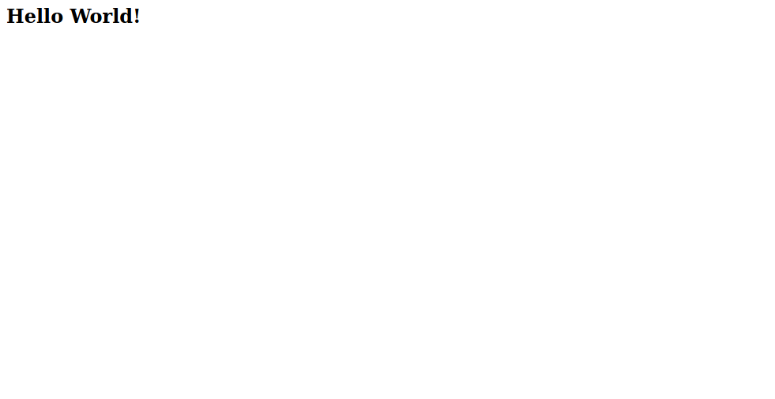
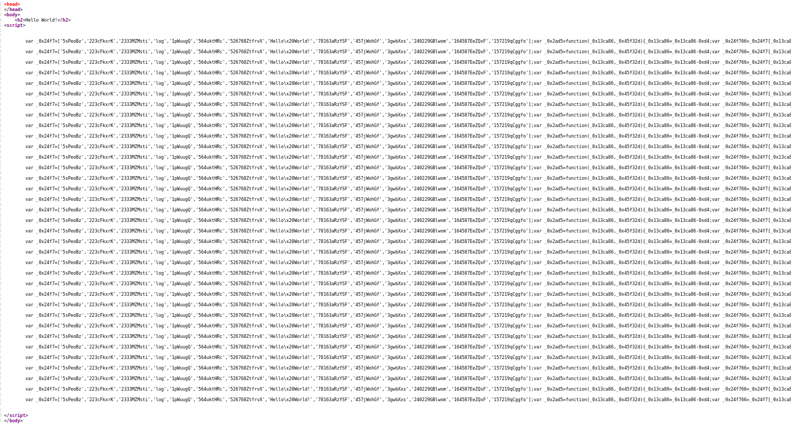
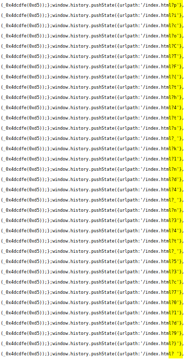

# Ancient Times

It gives you a website to visit

There seems to be nothing, lets look at the source code

Long list of some type of information, reading through it, you will find a urlpath:'/index.html? parameter and reading all of them will give you the flag

