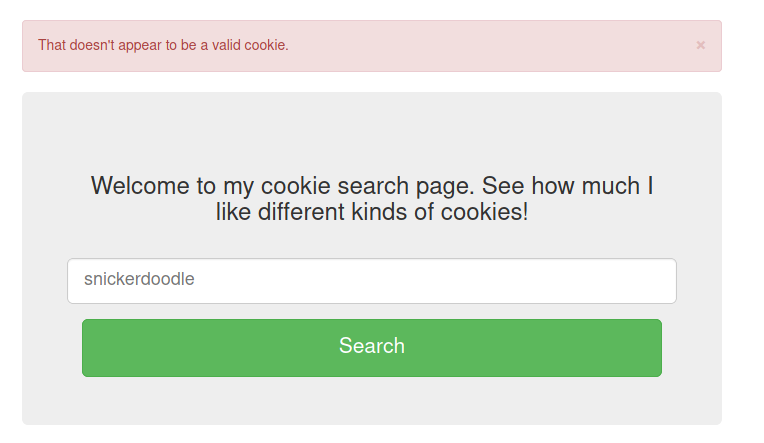
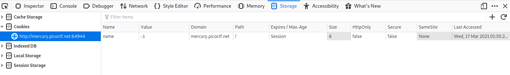
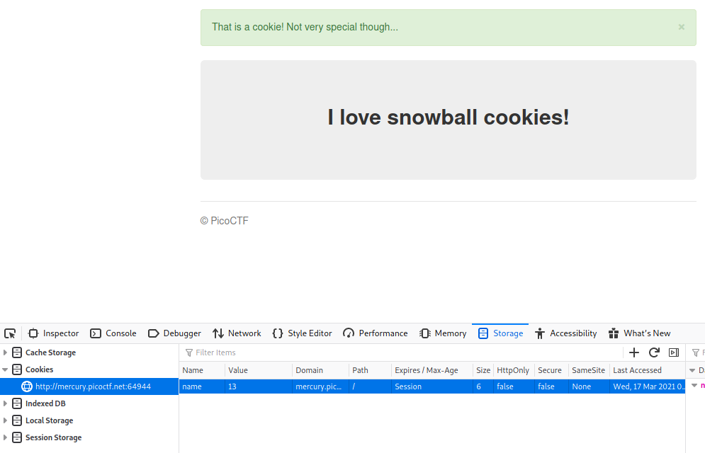
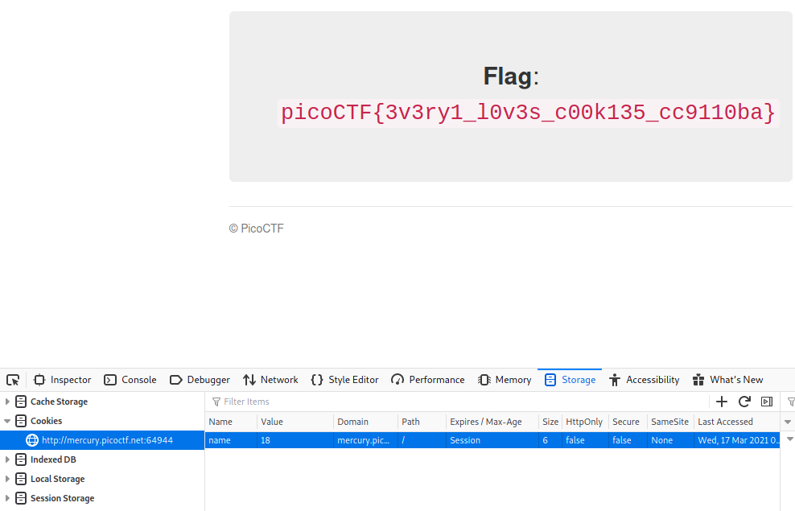

# Cookies

> Who doesn't love cookies? Try to figure out the best one. http://mercury.picoctf.net:64944/

You're greeted with a webpage where you can enter commands and click a button to search, whatever you type it returns

As the room name is Cookies, it makes sense if we go check out the cookies

**Ctrl + I , Storage**

There is a value for the cookie, it is a number.

I wonder what happens if we change it and reload the page.

Oh, we get an output. If you test different values, you get different outputs, everntually when you get to the right number you find the flag

**picoCTF{3v3ry1_l0v3s_c00k135_cc9110ba}**
