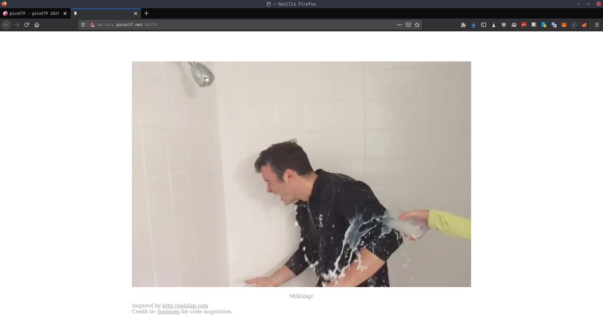
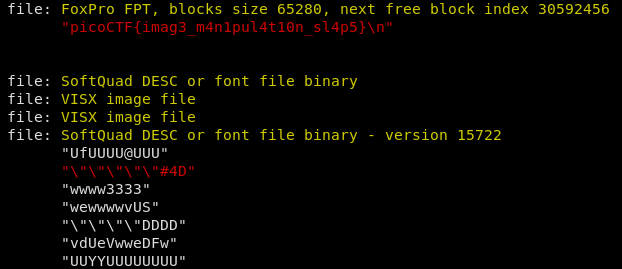

# Milk Slap
Solved by Skuzi and aHaquer

> http://mercury.picoctf.net:48319/

When we go to this site, we're presented with this, apparently inspired by "[eelslap](http://eelslap.com/)"

This image shifts as we move our mouse, allowing us to slap our friend here with milk.
Given that this is a forensics challenge, we need to extract this image to then analyze it.

To do this, we right click the gif and select "view background image" in our browser.
Save the image we find gets us [this](pics/milkslap-long.png)

We can then run [zsteg](https://github.com/zed-0xff/zsteg) on this file to check for [LSB](https://www.boiteaklou.fr/Steganography-Least-Significant-Bit.html) and get our flag!

We get:

**picoCTF{imag3_m4n1pul4t10n_sl4p5}**