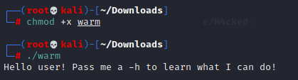
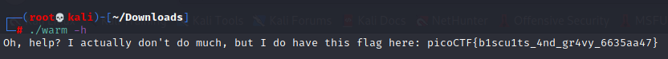

# Wave a Flag

> Can you invoke help flags for a tool or binary? This program has extraordinarily helpful information...

We download a binary.

**warm**

To run it, give it executable permissions 

Use the -h the next time you run it

You got the flag

