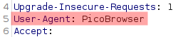

# Who are you?

Solved by aHaquer

> Let me in. Let me iiiiiiinnnnnnnnnnnnnnnnnnnn http://mercury.picoctf.net:34588/

We're given a very scrutinizing web page, and off the bat we're told that only those who use the official "PicoBrowser" can enter.

As far as I know, this challenge is entirely possible using only curl, but I would suggest using [Burp Suite](https://portswigger.net/burp) instead for ease.

To specify things like this, we need to use [HTTP Headers](https://developer.mozilla.org/en-US/docs/Web/HTTP/Headers). According to the glorious MDN web docs, HTTP Headers, "let the client and the server pass additional information with an HTTP request or response."

For the curious, we can specify headers like this with the -H flag in curl.
> curl -H "User-Agent: PicoBrowser" http://mercury.picoctf.net:34588/

To do this in Burp, we can: 

Go to the proxy tab and open the site in the embedded browser > intercept the request > select send to repeater under actions > *and actually do what we came here for*

For those new to Burp , once you set intercept on, I recommend that you select "sent to repeater" under action, and then click on the "repeater" tab.

Here, we should see something like this:

The [MDN web docs](https://developer.mozilla.org/en-US/) tell us that the http header User-Agent is, "a characteristic string that lets servers and network peers identify the application, operating system, vendor, and/or version of the requesting user agent." 
For example, we could set it to firefox like this:

To set it to "PicoBrowser" we just need to do 

This gets us past the first stage! Now we see:
> I don't trust users visiting form another site

With a little research, we find that the [referer](https://developer.mozilla.org/en-US/docs/Web/HTTP/Headers/Referer) header can control this.

In burp

Next up:
> Sorry, this site only worked in 2018

The [date](https://developer.mozilla.org/en-US/docs/Web/JavaScript/Reference/Global_Objects/Date) header is clearly what we need

MDN tells us that

In burp

Next up:
> I don't trust users who can be tracked

This is as simple as setting a "Do not track request"

In burp

Now we get
> This website is only for people from Sweden.

This one was a little less intuitive, but it's as simple as telling the website that this request was made by some IP in sweden. A quick google search tells us that the IP 81.229.119.123 is owned by the telia company, which is based in sweden. The [X-Forwarded-For](https://developer.mozilla.org/en-US/docs/Web/HTTP/Headers/X-Forwarded-For) header controls this.

At this point I've gotten a little sick of cropping screenshots from burp, or mdn, so I'll leave this up to the imagination.
Now we see
> You're in Sweden but you don't speak Swedish?

This final leg is as simple as setting our language to "sv" under the [Accept-Language](https://developer.mozilla.org/en-US/docs/Web/HTTP/Headers/Accept-Language)

Our final product is

And now, we've got our flag!
**picoCTF{http_h34d3rs_v3ry_c0Ol_much_w0w_79e451a7}**