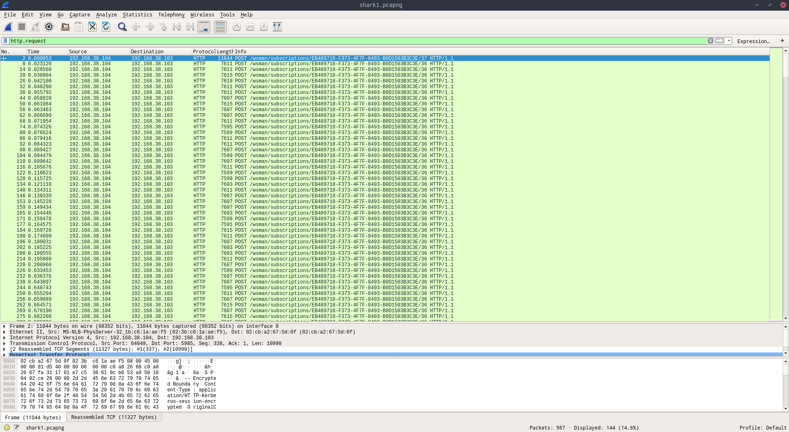
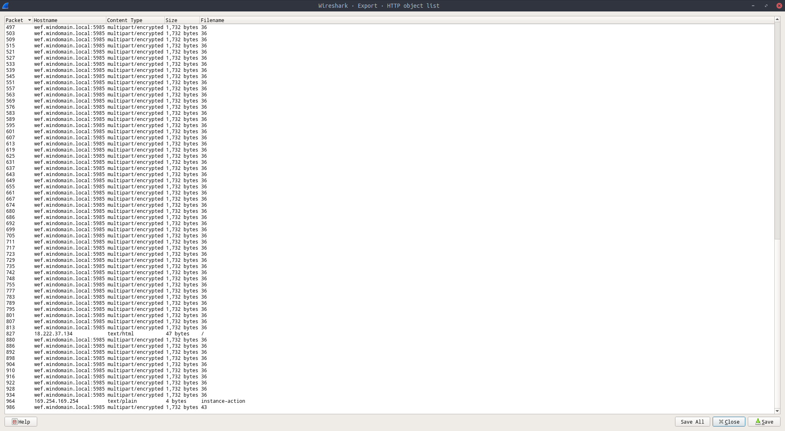

# Wireshark doo dooo do doo...

> Can you find the flag? shark1.pcapng.

We're given a wireshark .pcapng file to investigate.
My first inclination is to follow the TCP streams, but this bears no results.
Instead, we need to filter for and then export to examine the HTTP requests.
Once we filter for "http.request" we get this

To then export this information (or specific bits of it) we do 
File > Export Objects > HTTP
And see

If we scroll down we see the more promising request

Once we export this we can cat it out in the terminal, and we get text that's clearly the product of a substitution cipher.

> Gur synt vf cvpbPGS{c33xno00_1_f33_h_qrnqorrs}

Our flag is the ROT13 decrypt of this:
**picoCTF{p33kab00_1_s33_u_deadbeef}**